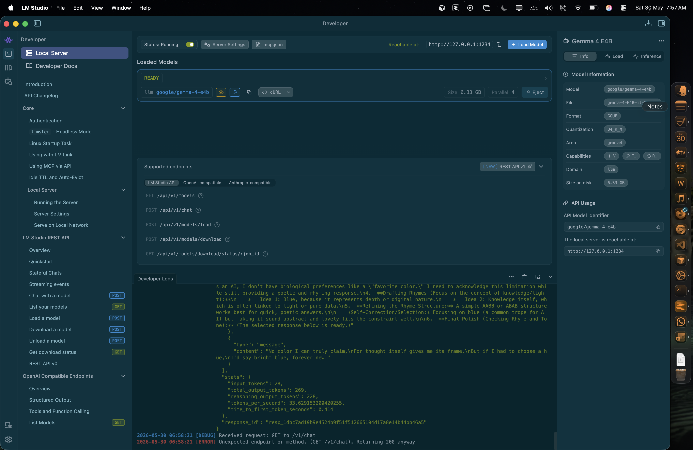

# Local AI on a MacBook Air M5

A living research repository documenting local AI model performance on consumer hardware.

Built by StackPilot Labs.

**Primary test machine:**

| Component | Details |
|-----------|---------|
| Machine | MacBook Air M5 |
| Memory | 16 GB unified RAM |
| Storage | 1 TB SSD |
| OS | macOS Tahoe |
| Primary Runtime | LM Studio |
| Last Updated | May 2026 |

---

## How to Read This Repo

This is not a generic setup guide. It is a structured research log.

- **Start with the methodology** → [`docs/00-methodology.md`](docs/00-methodology.md) — understand what is measured and how.
- **See what has been run** → [`EXPERIMENT-LOG.md`](EXPERIMENT-LOG.md) — dated session log.
- **See the raw benchmark data** → [`docs/10-benchmarks.md`](docs/10-benchmarks.md) — one entry per model tested.
- **Compare models** → [`docs/08-model-comparison.md`](docs/08-model-comparison.md) — only confirmed measurements appear here.
- **Read model-specific notes** → individual docs below.
- **Reproduce a test** → [`examples/benchmark-prompts.md`](examples/benchmark-prompts.md) — exact prompts used.

---

## Research Status

| Model | Status | tok/s | Notes |
|-------|--------|-------|-------|
| Gemma 4 E4B (Q4_K_M) | ✅ Partially tested | 33.6 | Speed confirmed. Qualitative tests pending. |
| Qwen | 🔜 Planned | — | — |
| DeepSeek | 🔜 Planned | — | — |

---

## Documents

| # | Document | Purpose |
|---|----------|---------|
| 00 | [Methodology](docs/00-methodology.md) | How benchmarks are run and what is measured |
| 01 | [LM Studio](docs/01-lmstudio.md) | Runtime setup and test configuration |
| 02 | [Ollama](docs/02-ollama.md) | Secondary runtime notes |
| 03 | [Gemma](docs/03-gemma.md) | Gemma 4 E4B model notes |
| 04 | [Qwen](docs/04-qwen.md) | Qwen model notes (not yet tested) |
| 05 | [DeepSeek](docs/05-deepseek.md) | DeepSeek model notes (planned) |
| 06 | [Cursor Integration](docs/06-cursor-integration.md) | Connecting local models to Cursor IDE |
| 07 | [M5 Hardware Notes](docs/07-macbook-air-guide.md) | M5-specific performance observations |
| 08 | [Model Comparison](docs/08-model-comparison.md) | Side-by-side — confirmed measurements only |
| 09 | [Troubleshooting](docs/09-troubleshooting.md) | Issues encountered during testing |
| 10 | [Benchmarks](docs/10-benchmarks.md) | Raw benchmark data per model |

---

## Screenshots

### Gemma 4 E4B Running in LM Studio

