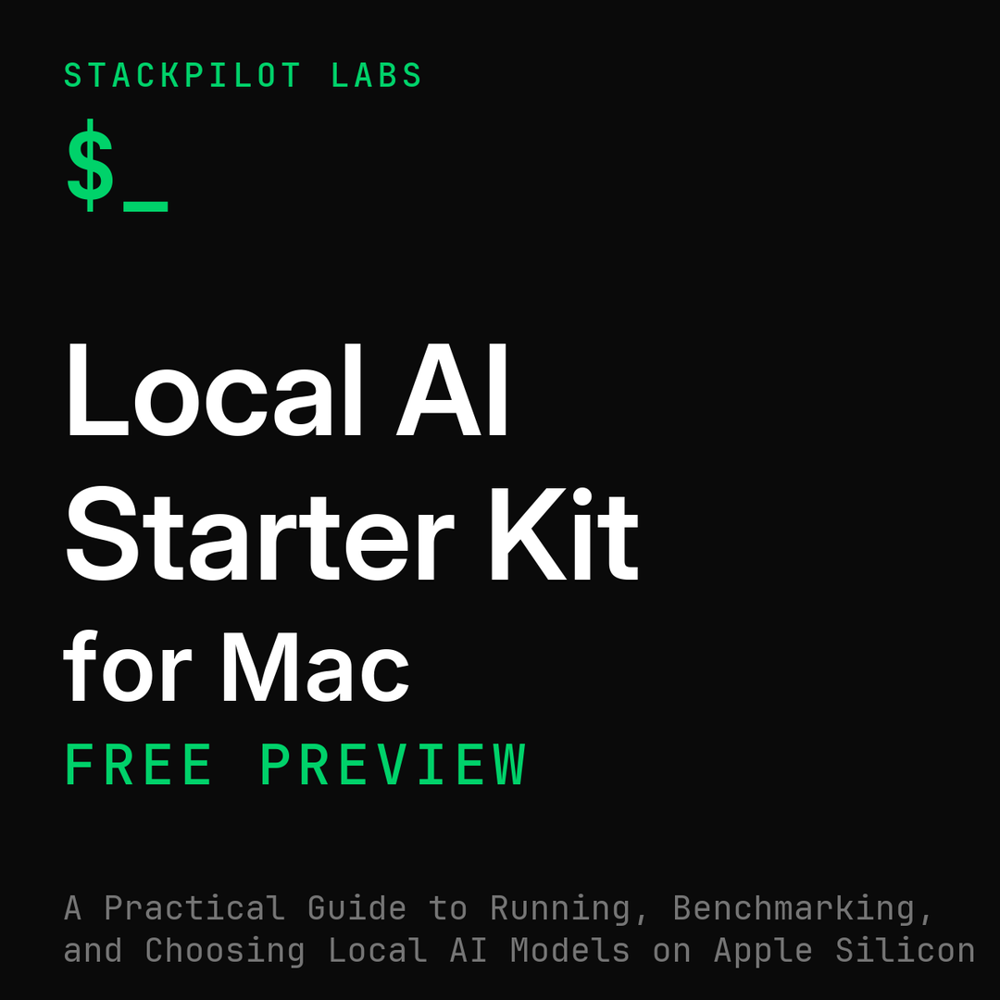
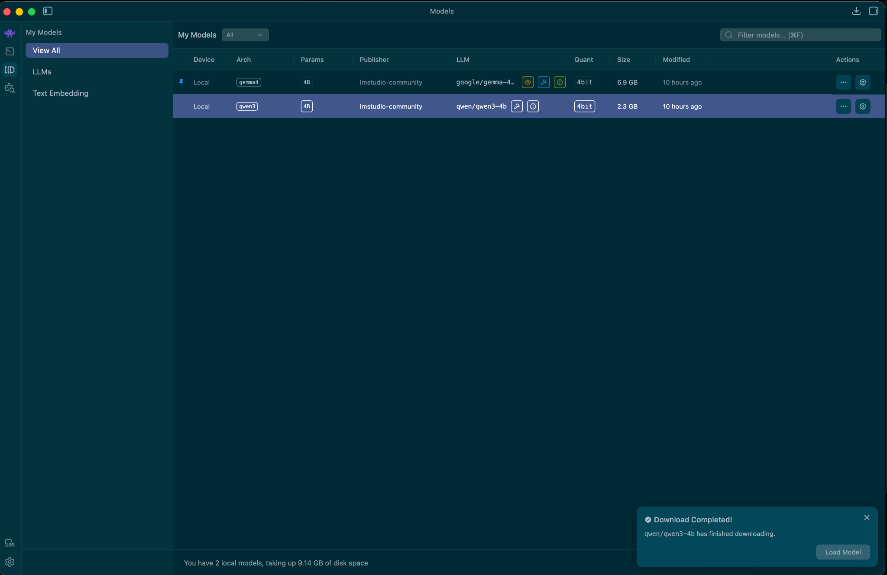

# Local AI on a MacBook Air M5

A living research repository documenting local AI model performance on consumer hardware.

Built by [StackPilot Labs](https://stackpilot1.gumroad.com/).

---

## Local AI Starter Kit for Mac

**Want more than chat?** Run local models on your Mac with documented benchmark evidence — LM Studio setup, Gemma vs Qwen3 selection, API integration, and five workflow patterns. [**Free 15-page preview**](https://stackpilot1.gumroad.com/l/local-ai-starter-kit-preview) · [**Full guide ($19)**](https://stackpilot1.gumroad.com/l/local-ai-starter-kit-mac)

This repo is the research base. The [**Local AI Starter Kit for Mac**](https://stackpilot1.gumroad.com/l/local-ai-starter-kit-mac) is the complete 94-page walkthrough — tested on a MacBook Air M5 with 16 GB unified memory.

| | |
|---|---|
| **Free preview** (15 pages) | [Download — no cost](https://stackpilot1.gumroad.com/l/local-ai-starter-kit-preview) |
| **Full guide** ($19 launch) | [Get the complete kit](https://stackpilot1.gumroad.com/l/local-ai-starter-kit-mac) |

**Benchmark evidence from this machine:**

| Model | Coding | Refactoring | Reasoning | Speed |
|-------|--------|-------------|-----------|-------|
| Gemma 4 E4B (GGUF Q4_K_M) | PASS | PASS | PASS | ~33 tok/s |
| Qwen3 4B (MLX 4-bit) | PASS | PASS | PASS | 46–50 tok/s |

*Every figure above is from a recorded session on the hardware listed below — not interpolated.*

**What the guide adds beyond this repo:** step-by-step setup, full benchmark suite with screenshots, decision matrix, five workflow patterns, and a troubleshooting reference. **What stays free here:** methodology, raw benchmark data, comparison tables, and reproducible prompts.

---

## Primary test machine

| Component | Details |
|-----------|---------|
| Machine | MacBook Air M5 |
| Memory | 16 GB unified RAM |
| Storage | 1 TB SSD |
| OS | macOS Tahoe |
| Primary Runtime | LM Studio |
| Latest activity | See [EXPERIMENT-LOG.md](EXPERIMENT-LOG.md) |

---

## How to Read This Repo

This is not a generic setup guide. It is a structured research log.

- **Start with the methodology** → [`docs/00-methodology.md`](docs/00-methodology.md) — understand what is measured and how.
- **See what has been run** → [`EXPERIMENT-LOG.md`](EXPERIMENT-LOG.md) — dated session log.
- **See the raw benchmark data** → [`docs/10-benchmarks.md`](docs/10-benchmarks.md) — one entry per model tested.
- **Compare models** → [`docs/08-model-comparison.md`](docs/08-model-comparison.md) — only confirmed measurements appear here.
- **Read model-specific notes** → individual docs below.
- **Reproduce a test** → [`examples/benchmark-prompts.md`](examples/benchmark-prompts.md) — exact prompts used.

**Want the full walkthrough?** Start with the [free preview](https://stackpilot1.gumroad.com/l/local-ai-starter-kit-preview), then upgrade to the [complete guide](https://stackpilot1.gumroad.com/l/local-ai-starter-kit-mac) if it fits your setup.

---

## Research Status

| Model | Status | tok/s | Notes |
|-------|--------|-------|-------|
| Gemma 4 E4B (Q4_K_M) | ✅ Benchmark suite complete | 33.6 | All 3 v1 prompts passed. |
| Qwen3 4B (MLX 4-bit) | ✅ Benchmark suite complete | 46–50 | All 3 v1 prompts passed. Think mode disabled. |
| DeepSeek | 🔜 Planned | — | — |

---

## Documents

| # | Document | Purpose |
|---|----------|---------|
| 00 | [Methodology](docs/00-methodology.md) | How benchmarks are run and what is measured |
| 01 | [LM Studio](docs/01-lmstudio.md) | Runtime setup and test configuration |
| 02 | [Ollama](docs/02-ollama.md) | Secondary runtime notes |
| 03 | [Gemma](docs/03-gemma.md) | Gemma 4 E4B model notes |
| 04 | [Qwen3 4B](docs/04-qwen.md) | Qwen3 4B model notes (benchmark suite complete) |
| 05 | [DeepSeek](docs/05-deepseek.md) | DeepSeek model notes (planned) |
| 06 | [Cursor Integration](docs/06-cursor-integration.md) | Connecting local models to Cursor IDE |
| 07 | [M5 Hardware Notes](docs/07-macbook-air-guide.md) | M5-specific performance observations |
| 08 | [Model Comparison](docs/08-model-comparison.md) | Side-by-side — confirmed measurements only |
| 09 | [Troubleshooting](docs/09-troubleshooting.md) | Issues encountered during testing |
| 10 | [Benchmarks](docs/10-benchmarks.md) | Raw benchmark data per model |
| — | [Product (v1.0)](docs/products/local-ai-starter-kit/README.md) | Guide source, build config, release notes |

---

## Screenshots

### Gemma 4 E4B Running in LM Studio

### Qwen3 4B Installed in LM Studio

---

## Contributing

This is a single-machine research repo, but the methodology is designed to be reproducible. If you have an M-series MacBook and want to contribute results:

1. **Read the methodology** → [`docs/00-methodology.md`](docs/00-methodology.md). All tests must follow this protocol to be comparable.
2. **Use the benchmark prompts** → [`examples/benchmark-prompts.md`](examples/benchmark-prompts.md). Run the exact versioned prompts — do not paraphrase or modify them.
3. **Record your results** using the entry template in [`docs/10-benchmarks.md`](docs/10-benchmarks.md). Include your machine spec, OS version, LM Studio version, quantisation, and all settings.
4. **Open a pull request** with your results added to `docs/10-benchmarks.md` and a new entry in `EXPERIMENT-LOG.md`. Note your hardware clearly — results from different machines are welcome as long as they are labelled.

Results from machines other than the M5 MacBook Air (16 GB) will be accepted but kept in a separate section to avoid mixing hardware configurations in the main comparison table.
