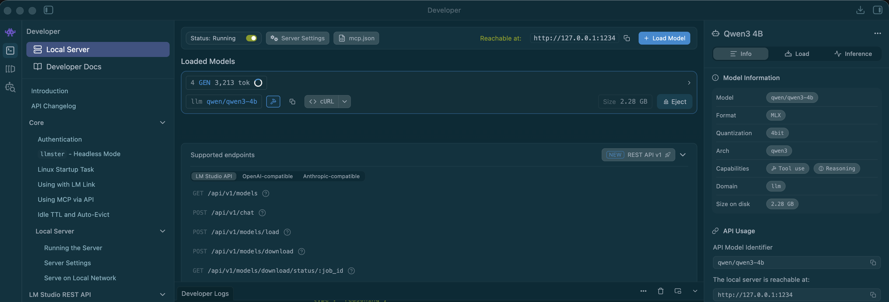

# Qwen3 4B

> **Test status:** Benchmark suite complete — all 3 Benchmark v1 prompts passed.
>
> See [`docs/10-benchmarks.md`](10-benchmarks.md) for raw results and [`EXPERIMENT-LOG.md`](../EXPERIMENT-LOG.md) for session notes.

---

## About This Model

Qwen3 4B is a 4-billion-parameter model from the Qwen3 generation (Alibaba Cloud). On this machine it is installed as an **MLX 4-bit** build via LM Studio — a different format from the GGUF Q4_K_M builds used for Gemma 4 E4B benchmarking.

- **LM Studio ID:** `qwen/qwen3-4b`
- **Architecture:** `qwen3`
- **Parameters:** 4B
- **Publisher:** `lmstudio-community`
- **Quantisation:** MLX 4-bit
- **Size on disk:** 2.28 GB

> Qwen 2.5 variants (e.g. qwen2.5-coder:7b) were originally planned. **Qwen3 4B** is the model now installed on this machine for the next benchmark round.

---

## Installation

Qwen3 4B (MLX 4-bit) was downloaded through LM Studio.


---

## Installed Variant (16 GB MacBook Air M5)

| Field | Value |
|-------|-------|
| Model | `qwen/qwen3-4b` |
| Format | MLX 4-bit |
| Size on disk | 2.28 GB |
| Runtime | LM Studio |

---

## Loading in LM Studio

1. Open LM Studio → **My Models**
2. Select `qwen/qwen3-4b`
3. Click **Load** — confirm the model appears under **Loaded Models**
4. Open **Developer** → **Local Server**, start the server (`http://127.0.0.1:1234`)
5. Monitor RAM in Activity Monitor before running benchmarks

---

## Loaded in LM Studio

`qwen/qwen3-4b` was loaded and the local server was started in LM Studio.



**Observed from LM Studio (Model Information panel):**

| Field | Value |
|-------|-------|
| Model | `qwen/qwen3-4b` |
| Format | MLX |
| Quantisation | 4-bit |
| Architecture | `qwen3` |
| Size on disk | 2.28 GB |
| Capabilities | Tool use, Reasoning |
| Local server | `http://127.0.0.1:1234` (running) |
| API compatibility | LM Studio API, OpenAI-compatible, Anthropic-compatible |

> All Benchmark v1 prompts were run against this loaded instance with Think mode **disabled**. See [`docs/10-benchmarks.md`](10-benchmarks.md) for results.

**Via Ollama (secondary — not used for primary benchmarks):**

```bash
ollama search qwen3    # confirm exact tag before pulling
```

> Ollama model tags do not match LM Studio MLX builds. Cross-runtime comparison is a planned future experiment.

---

## Confirmed Measurements (M5 MacBook Air, 16 GB)

| Metric | Value |
|--------|-------|
| Quantisation | MLX 4-bit |
| Size on disk | 2.28 GB |
| Tokens per second | 46–50 (46.84 / 46.02 / 49.53 per run) |
| RAM usage (loaded, idle) | [ to be measured ] |
| Startup time (cold) | [ to be measured ] |

| Test | Result | Notes |
|------|--------|-------|
| Coding benchmark | PASS | 46.84 tok/s; Think mode disabled |
| Refactoring benchmark | PASS | 46.02 tok/s |
| Reasoning benchmark | PASS | 49.53 tok/s; correct answer (9) |

> Measurement conditions: see [`docs/00-methodology.md`](00-methodology.md). Benchmark prompts: [`examples/benchmark-prompts.md`](../examples/benchmark-prompts.md).

---

## Observations

- Think mode **enabled** caused prolonged token generation without a final answer during an initial coding attempt; model was ejected and reloaded.
- All Benchmark v1 prompts passed with Think mode **disabled** (46–50 tok/s across runs).
- Faster than Gemma 4 E4B (~32–34 tok/s) on identical prompts; quality comparable across all three categories.

---

## Hypotheses (To Be Validated)

- Smaller on-disk footprint (2.3 GB vs Gemma 4 E4B at 6.33 GB) may reduce load time — to be measured.
- MLX 4-bit on Apple Silicon may differ in tok/s from GGUF Q4_K_M — direct comparison with Gemma 4 E4B is the goal.
- Coding and reasoning quality relative to Gemma 4 E4B — validated: both passed all v1 prompts; Qwen3 faster on tok/s.

---

## What to Test First

- [x] Load `qwen/qwen3-4b` and start local server in LM Studio
- [ ] Confirm RAM usage is within bounds on 16 GB during inference
- [x] Run Coding Benchmark v1 (same prompt as Gemma 4 E4B) — PASS at 46.84 tok/s
- [x] Run Refactoring Benchmark v1 — PASS at 46.02 tok/s
- [x] Run Reasoning Benchmark v1 — PASS at 49.53 tok/s
- [x] Record tok/s, qualitative results, and screenshots in `docs/10-benchmarks.md`
- [x] Compare side-by-side with Gemma 4 E4B results in `docs/08-model-comparison.md`
